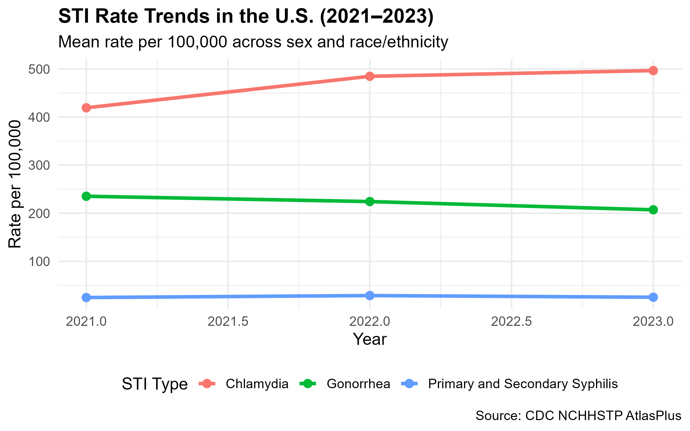
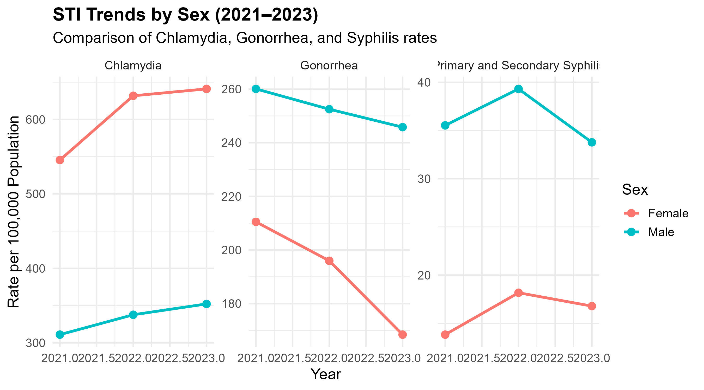

# STI Surveillance Analysis (2021–2023)

### Objective
Analyze sexually transmitted infection (STI) trends in Georgia and the U.S. (2021–2023), focusing on chlamydia, gonorrhea, and syphilis across demographics and regions.

### Methods
- **Data Source:** CDC NCHHSTP AtlasPlus (Sexually Transmitted Diseases Dataset)
- **Tools Used:** R, SAS, Tableau  
- **Tasks:**  
  - Data cleaning and filtering by year, disease, and demographics  
  - Trend analysis and visualization  
  - Rate comparisons by year and population group  
  - Highlighting patterns in STI rate increases or decreases post-pandemic
    
### Variables Used
The dataset includes the following core variables extracted from CDC NCHHSTP AtlasPlus:

| Variable | Description |
|-----------|--------------|
| **Year** | Reporting year (2021–2023) |
| **State / Location** | U.S. state or territory where cases were reported |
| **Disease** | Type of STI (Chlamydia, Gonorrhea, Primary & Secondary Syphilis) |
| **Sex** | Reported sex of cases (Male, Female, Unknown) |
| **Race/Ethnicity** | Reported racial or ethnic category |
| **Cases** | Number of reported STI cases |
| **Rate per 100,000** | Calculated rate of cases per 100,000 population |
| **Population** | Population denominator for rate calculation |

Additional variables may include age group or data notes, depending on the CDC export options selected.

### Notes
Data from 2020–2021 were impacted by COVID-19 testing and reporting disruptions. To ensure stability in year-to-year comparisons, this analysis focuses on data from **2021–2023**, which reflect more normalized surveillance and testing patterns.

## 🔍 Key Findings (2021–2023): STI Trends by Sex

**Chlamydia**
- Rates increased gradually for both males and females from 2021 to 2023.  
- Females consistently showed **significantly higher case rates** than males, aligning with national surveillance patterns.  
- The most notable rise occurred between **2021 and 2022**, suggesting possible effects of post-pandemic testing normalization.

**Gonorrhea**
- Males exhibited **higher gonorrhea rates** than females across all three years.  
- Both sexes showed a **modest decline** from 2021 to 2023, possibly reflecting improved treatment and awareness campaigns.

**Primary & Secondary Syphilis**
- Syphilis rates were higher among males, continuing a known epidemiologic trend.  
- A **notable surge** occurred between 2021 and 2022, likely influenced by post-COVID disruptions in care.  
- By 2023, rates began to **decline**, suggesting targeted public health interventions may have been effective.

---
## 📄 Reports (1-Page Summary)
- **Academic :** [STI_Surveillance_Report_Academic.pdf](./docs/STI_Surveillance_Report_Academic.pdf)

**Summary Insight:**  
Across all three infections, **gender disparities remain evident**, with females bearing a heavier burden of chlamydia and males showing higher gonorrhea and syphilis rates. The stabilization and modest declines after 2022 may signal successful control and prevention strategies following pandemic-related disruptions.
  

### 📈 Visualizations  

**Figure 1. Overall STI Trends (2021–2023)**  

**Figure 2. STI Trends by Sex (2023)**  

---

📅 *In progress – Project will be updated as analyses and visuals are completed.*
